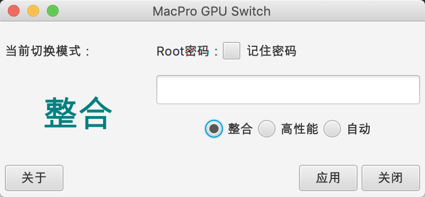

MacPro GPU Switch
=============

A JavaFX project to execute "sudo pmset -a GPUSwitch".

一个基于JavaFX开发的MacBookPro显卡切换工具

说明
============

本软件通过执行MacOS电源管理pmset命令修改电源管理配置达到显卡切换的目的

理论支持上支持所有可以用"sudo pmset -a GPUSwitch"切换显卡的型号

！！！只有核显的机器切勿尝试！！！

支持型号
============
* MacBook Pro（15-inch，2018）macOS Mojave 10.14.3

欢迎大家补充

开发环境
============
* Apache Maven 3.6
* Java Developer Kit 8
* IntelliJ IDEA 2018.3

历史版本
============
See [CHANGELOG.md](CHANGELOG.md)
